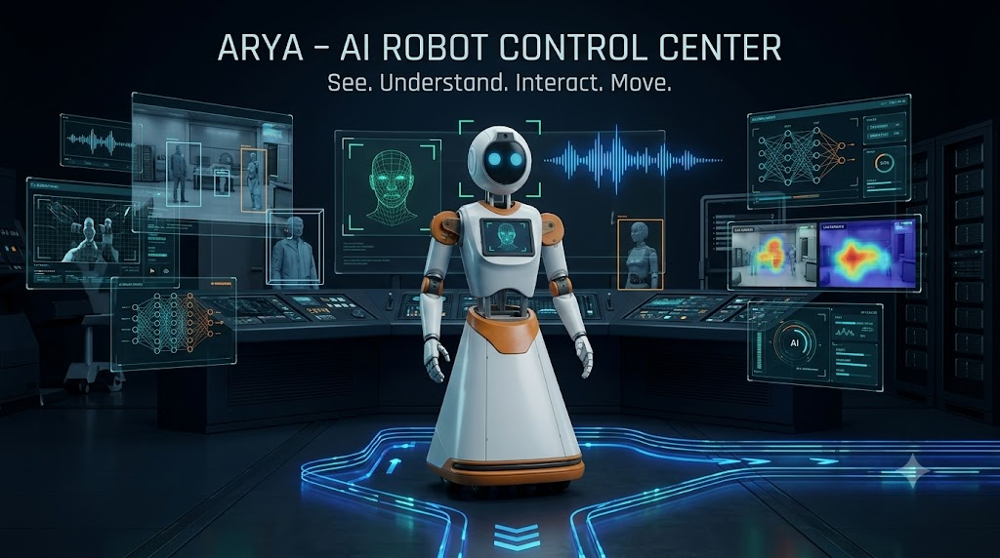
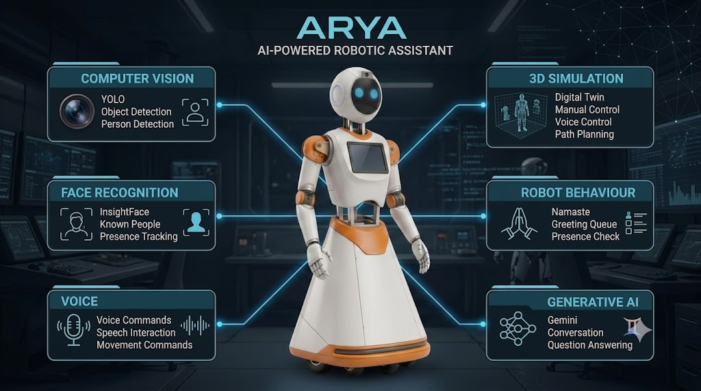
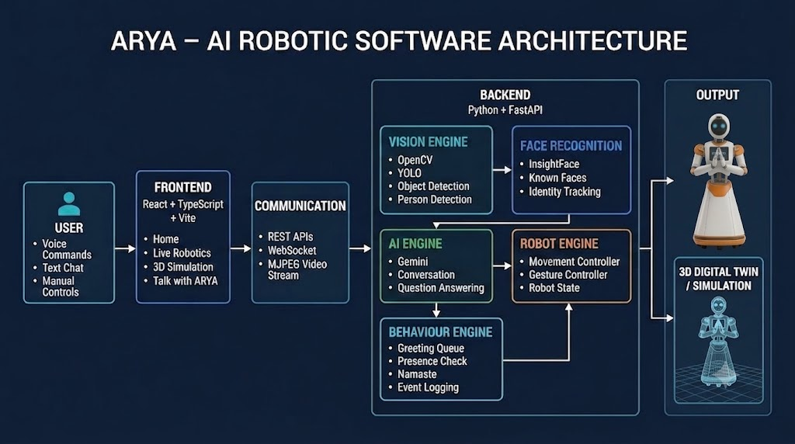
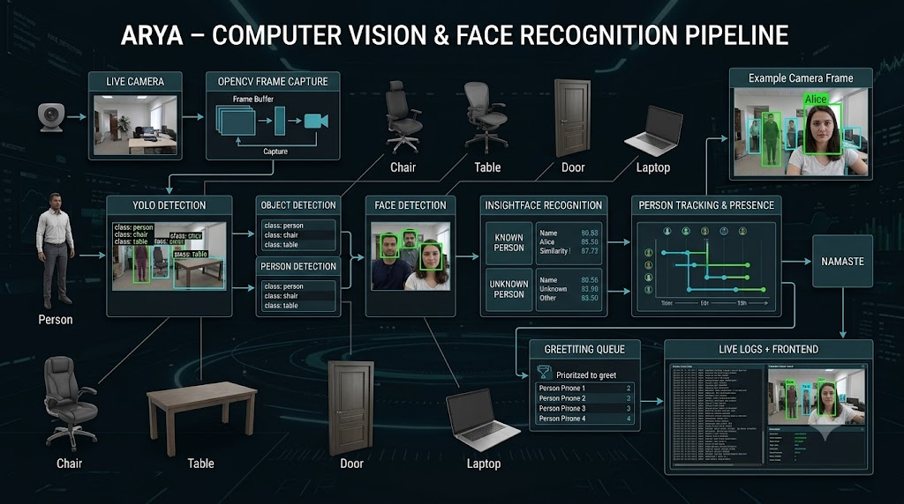

# 🤖 ARYA — AI-Powered Robotic Control Center

<p align="center">
  
</p>

<p align="center">
  <strong>See. Understand. Interact. Move.</strong><br>
  An AI-powered robotic software platform combining Computer Vision, Face Recognition,
  Voice Interaction, Generative AI and interactive 3D robotic simulation.
</p>

<p align="center">
  
  
  
  
  
</p>

---

## 🌟 Overview

**ARYA (AI-powered Robotic Assistant)** is a unified robotic software platform developed by **Fire Brand AI**.

It combines:

- 👁️ Computer Vision
- 🧑 Face Detection & Recognition
- 🎤 Voice Commands
- 🧠 Generative AI
- 🤖 Robot Movement & Behaviour
- 🗺️ Station-based navigation concepts
- 🧊 Interactive 3D simulation
- 📡 Real-time frontend/backend communication

The goal is to provide one **Robot Control Center** instead of treating perception, conversation, movement and simulation as separate applications.

> **ARYA is designed to see the environment, recognize people, understand commands, respond intelligently and visualize robotic behaviour in live and simulated environments.**

---

## ✨ Main Features

### 📹 1. Live Robotics

<p align="center">
  
</p>

The Live Robotics interface connects the frontend to the Python backend for real-time robotic interaction.

**Features:**

- Live camera feed
- YOLO object detection
- Person detection
- Face recognition using the existing recognition pipeline
- Recognized-person status
- Movement controls
- Voice movement commands
- Robot state and movement status
- Digital-twin visualization
- Live logs and events

Example commands:

```text
Arya, move front
Arya, move back
Arya, turn left
Arya, turn right
Arya, stop
```

---

### 🧊 2. 3D Simulation

<p align="center">
  
</p>

ARYA includes an interactive 3D robotic environment built using **Three.js / React Three Fiber**.

**Simulation features:**

- Interactive 3D ARYA
- Orbit, zoom and pan
- Manual movement
- Voice movement commands
- Station destinations
- Path visualization
- Waypoints
- Simulation status
- Simulation logs

Available stations include:

```text
Vision Station
Control Station
Lab Station
Library
```

Example:

```text
User selects Library
        ↓
Route is generated
        ↓
Waypoints are displayed
        ↓
3D ARYA follows the simulated path
```

> The 3D movement and telemetry are software simulation. Physical motor/chassis telemetry depends on the robot hardware configuration.

---

### 💬 3. Talk with ARYA

<p align="center">
  
</p>

The Talk with ARYA interface provides conversational interaction.

Wake interaction:

```text
User: Arya
ARYA: Yes, how can I help you today?
```

Users can then ask questions such as:

```text
Introduce yourself.
What can you do?
Tell me about this campus.
Where is the library?
```

The backend can use existing project responses/logic and Gemini for general questions.

The Gemini API key remains on the backend and should never be exposed in the frontend.

---

## 👁️ Computer Vision Pipeline

<p align="center">
  
</p>

ARYA's live vision flow is designed around:

```text
                 CAMERA
                    │
                    ▼
             YOLO Detection
                    │
          ┌─────────┴─────────┐
          │                   │
       Objects             Persons
                              │
                              ▼
                       Face Detection
                              │
                              ▼
                         InsightFace
                              │
                    ┌─────────┴─────────┐
                    │                   │
                Recognized            Unknown
                    │
                    ▼
              Frontend / Logs
```

The project contains a YOLO model for object/person detection and an existing known-face recognition data pipeline.

---

## 🙏 Namaste / Greeting Behaviour

ARYA includes a greeting-management flow intended to avoid repeatedly greeting the same person.

```text
Person detected
      ↓
Face recognized
      ↓
Already greeted?
   ┌──┴──┐
  YES    NO
   │      │
 Ignore   ↓
       Greeting Queue
            ↓
    Is person still present?
        ┌───┴───┐
       NO       YES
        │         │
      Remove    Namaste
                  ↓
           Mark as greeted
                  ↓
             Next person
```

If another person appears while ARYA is greeting someone, that person can be queued and checked after the current greeting.

---

## 🏗️ System Architecture

```text
┌──────────────────────────────────────────────────────────────┐
│                       ARYA FRONTEND                          │
│                 React + TypeScript + Vite                    │
│                                                              │
│  Home │ Live Robotics │ 3D Simulation │ Talk with ARYA       │
└──────────────────────────────┬───────────────────────────────┘
                               │
                    REST / WebSocket / MJPEG
                               │
                               ▼
┌──────────────────────────────────────────────────────────────┐
│                       FASTAPI BACKEND                        │
│                                                              │
│ Vision Service │ Chat Service │ Robot Commands │ Behaviour   │
│       │               │                │              │       │
│       ▼               ▼                ▼              ▼       │
│   YOLO /           Gemini          Movement        Greeting   │
│ InsightFace         AI             Control         Manager    │
│       │               │                │              │       │
│       └───────────────┴────────────────┴──────────────┘       │
│                         │                                    │
│                    Camera / Events                           │
└──────────────────────────────────────────────────────────────┘
```

---

## 🧰 Technology Stack

### Frontend

- React
- TypeScript
- Vite
- Three.js
- React Three Fiber
- React Three Drei
- Lucide React

### Backend

- Python
- FastAPI
- Uvicorn
- OpenCV
- Ultralytics YOLO
- InsightFace
- ONNX Runtime
- Google GenAI SDK
- SpeechRecognition
- PyAudio
- SoundDevice

### Communication

- REST APIs
- WebSockets
- MJPEG live video streaming

---

## 📁 Project Structure

```text
ARYA_Complete/
│
├── backend/
│   └── AURA_Windows/
│       ├── vision_service.py
│       ├── chat_service.py
│       ├── web_server.py
│       ├── vivek_face.py
│       ├── vivek_interaction.py
│       ├── vivek_common.py
│       ├── yolov8n.pt
│       ├── known_faces/
│       ├── data/
│       ├── requirements.txt
│       ├── SETUP_NOTES.md
│       └── WEB_INTEGRATION.md
│
├── frontend/
│   └── arya-robot-control/
│       ├── src/
│       │   ├── components/
│       │   ├── hooks/
│       │   ├── pages/
│       │   ├── services/
│       │   ├── styles/
│       │   └── types/
│       ├── public/
│       ├── package.json
│       └── .env.example
│
├── docs/
│   └── images/
│       ├── arya-banner.jpeg
│       ├── boot-screen.jpeg
│       ├── home-dashboard.jpeg
│       ├── live-robotics.jpeg
│       └── simulation.jpeg
│
├── .gitignore
└── README.md
```

---

## 🚀 Quick Start

### 1. Clone the Repository

```bash
git clone https://github.com/prasad218/Final-Project---Fire_Brand_AI---Software-For-Robot-.git
cd Final-Project---Fire_Brand_AI---Software-For-Robot-
```

### 2. Start the Backend

```powershell
cd backend/AURA_Windows
python -m venv .venv
.venv\Scripts\activate
pip install -r requirements.txt
```

Configure your local environment as required by the backend.

For Gemini:

```env
GEMINI_API_KEY=your_key_here
```

Start the server:

```powershell
python web_server.py
```

The backend is normally available at:

```text
http://localhost:8000
```

### 3. Start the Frontend

Open another terminal:

```powershell
cd frontend/arya-robot-control
npm install
npm run dev
```

Open the Vite URL shown in the terminal.

If required, configure:

```env
VITE_API_BASE_URL=http://localhost:8000
```

---

## 🔌 Backend Interfaces

### Vision Stream

```text
GET /api/vision/mjpeg
```

Provides the annotated camera stream.

### Chat

```text
POST /api/chat
```

Used for ARYA conversation.

### Robot Command

```text
POST /api/robot/command
```

Used to send movement and robot commands.

### Vision WebSocket

```text
WS /ws/vision
```

Used for real-time vision information, people, objects and logs.

For the project-specific integration contract, see:

```text
backend/AURA_Windows/WEB_INTEGRATION.md
```

---

## 🔐 Configuration & Security

Never commit real API keys or secrets.

Use environment variables:

```env
GEMINI_API_KEY=your_key_here
```

Frontend:

```env
VITE_API_BASE_URL=http://localhost:8000
```

The repository is configured to keep local environment files and development artifacts out of version control.

---

## 🧪 Demonstration Flow

```text
                    BOOT ARYA
                       │
                       ▼
                      HOME
                       │
       ┌───────────────┼────────────────┐
       │               │                │
       ▼               ▼                ▼
 LIVE ROBOTICS    3D SIMULATION    TALK WITH ARYA
       │               │                │
       ├─ Camera       ├─ Manual        ├─ Wake word
       ├─ YOLO         ├─ Voice         ├─ Conversation
       ├─ Face         └─ Path          ├─ Recognition
       │                                  └─ Gemini
       ├─ Voice
       └─ Movement
```

---

## ⚠️ Project Scope

### Integrated Software Capabilities

- Live camera processing
- YOLO object/person detection
- Face recognition
- Recognition events
- Chat backend
- Gemini integration
- Voice/command interface
- Frontend/backend communication
- 3D robotic visualization
- Greeting management

### Simulation Capabilities

- 3D ARYA movement
- Simulated position and rotation
- Simulated telemetry
- Station navigation
- Autonomous route visualization
- Path and waypoint visualization

### Physical Hardware

The software architecture supports robot movement and gesture integration. Actual GPIO, motor and servo operation depends on the hardware-specific configuration used when deploying ARYA to the physical robot.

---

## 🎓 Project Objective

The objective of ARYA is to integrate:

> **Perception + Recognition + Voice + Intelligence + Behaviour + Simulation**

into one human-friendly robotic software platform.

The project demonstrates the integration of computer vision, conversational AI, voice interaction, robotic behaviour and 3D simulation in a unified system.

---

## 👥 Team

### Fire Brand AI

- **Shankarprasad K S**
- **Vignesh Rao**
- **Rakshitha K N**
- **Sowjanya**

### Aura Team

- **Prekshan R Rai**
- **Rakshith K**
- **Ashwanth**

### Guides / Mentors

- **Dr. Jeevitha Ravindra**
- **Dr. Rajani Rai**

---

## 🏷️ Project Identity

| Category | Details |
|---|---|
| Project | ARYA — Robot Control Center |
| Organization | Fire Brand AI |
| Type | AI + Robotics + Computer Vision + Generative AI + 3D Simulation |
| Frontend | React + TypeScript + Three.js |
| Backend | Python + FastAPI |
| Vision | YOLO + InsightFace |
| Generative AI | Gemini |
| Simulation | Three.js / React Three Fiber |

---

## 📜 License

This repository is an academic/student major project.

Add an open-source license if the project is formally released under a specific license.

---

<p align="center">
  <strong>🤖 ARYA</strong><br>
  <em>See. Understand. Interact. Move.</em>
</p>

<p align="center">
  Built with ❤️ by <strong>Fire Brand AI</strong>
</p>
